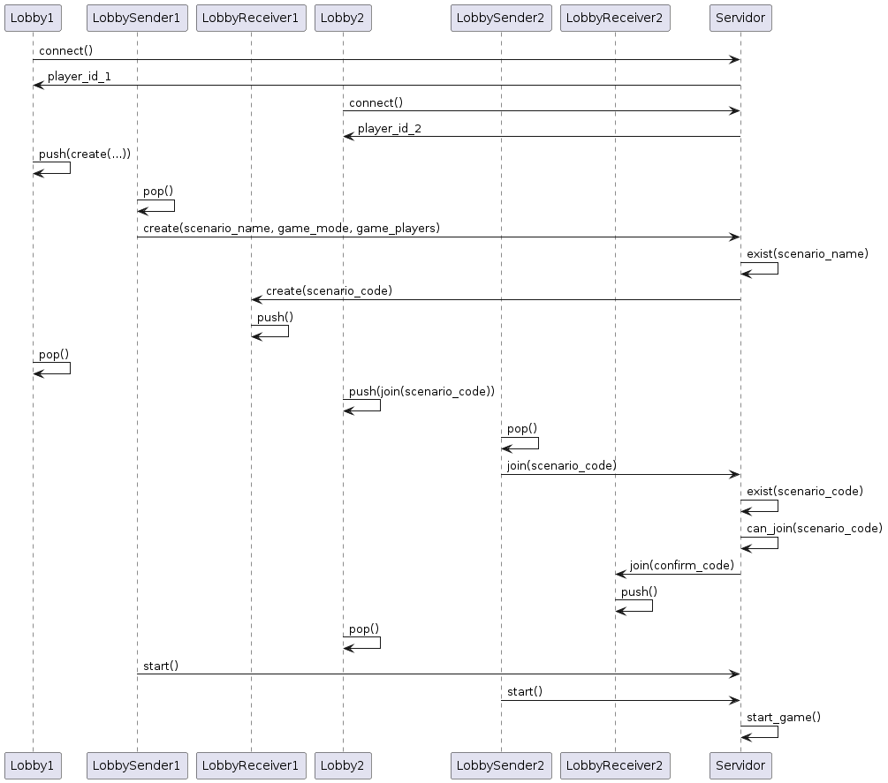
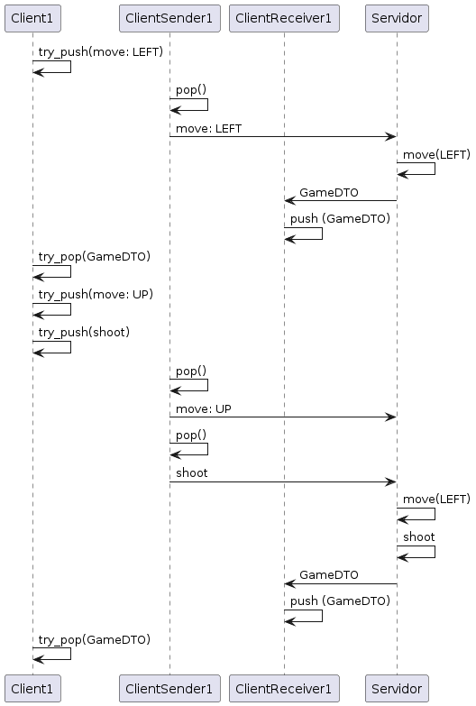
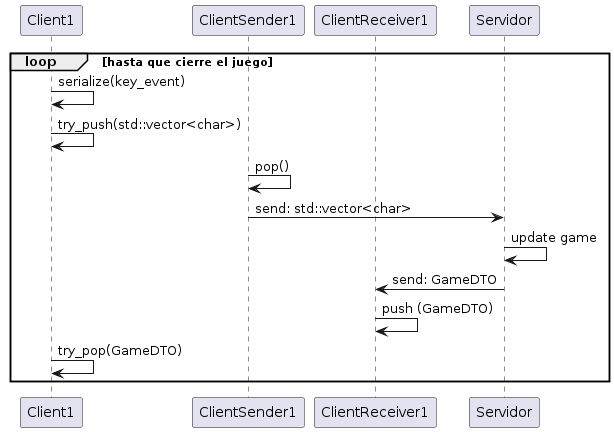
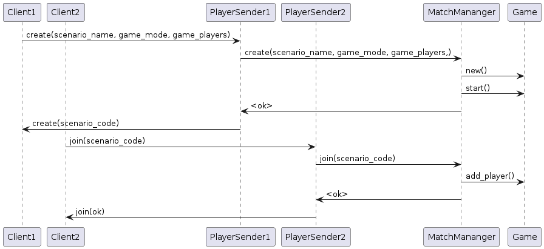

# Left 4 Dead - Manejo de hilos

En esta parte de la documentación explicaremos como se realizo el diseño de los hilos tanto del lado del cliente como del lado del servidor. Tambien explicaremos como se desarrollo la lógica para el manejo de distintas partidas y como manejamos los distintos jugadores que se pueden ir uniendo al servidor.

Algo a entender previo a esto es que el desarrollo del juego del lado del cliente se basa en 2 etapas:
* lobby
* juego

## Cliente

Partimos de la base de que

En la primera parte, el lobby, tendremos 3 threads:
* El principal: en este hilo es donde se hara el render tanto del lobby como del juego.
* El lobby_sender.
* El lobby_receiver.

En la segunda parte, cuando jugemos, tendremos 3 threads nuevamente:
* El principal: mismo que antes, se mantiene.
* El client_sender.
* El client_receiver.

El lobby_sender y el client_sender serán los hilos encargados de enviar mensajes mediante un *socket* al servidor mientras que el lobby_receiver y el client_receiver se encargaran de recibir mensajes del servidor. A su vez nuestro thread principal se comunicara con sus 2 hilos (al principio lobby_sender y lobby_receiver y luego client_sender y client_receiver) mediante el uso de *queues*. Es decir, el hilo principal estará haciendo peticiones sobre estas colas para enviar mensajes como para recibirlos.

Vamos a detallar ahora los mensajes que manejara cada hilo y que tipos de datos usamos para comunicarnos mediante las *queue* con los hilos.

### Mensajes dentro del lobby.

En la parte del lobby los mensajes que se podrán mandar serán principalmente 2:
* Crear una partida.
* Unirse a una partida.

Tanto en el lobby como proximamente en la etapa de juego los mensajes son serializados en el hilo principal. Esto es asi ya que se decidió que no era una operación costosa en tiempos de ejecución. Por otro lado es mas sencillo realizar esto ya que no tengo que utilizar un DTO para pushear en una cola para que el hilo sender tenga que obtener esa instruccion y serializarla ahi. Es por esto que tanto en el hilo lobby_sender como client_sender usaremos una cola que manejara vectores de tipo char: `Queue<std::vector<char>> queue_sender`. El protocolo de estos mensajes será el siguiente:

* Crear una partida: `<0x01> <scenario len> <scenario name> <game_mode> <game_players>`. El game_moode puede ser *Clear The Zone* (`<0x00>`) o *Survival* (`<0x01>`). Por otro lado la cantidad de jugadores dentro de una partida correpsonde a un numbero entre 1 y 4.
* Unirse una partida: `<0x02> <code>`. El code corresponde a un entero de 4 bytes.

En esta parte, por como se implemento el lobby en Qt, se decidició que la comunicación sea de forma sincrónica (algo que no es así cuando se este jugando). Es decir, nosotros haremos peticiones de crear una partida o unirnos a una y queremos que hasta que no recibamos respuesta del servidor sobre esta petición no podamos avanzar. De esta forma mantemeos un orden de ejecución dentro del lobby. 

Una vez que uno decida comenzar a jugar se le hara un join a los hilos `lobby_sender` y `lobby_receiver` y lo que haremos será mover el socket a un nuevo objeto llamado `Client` que se encargara de mantener la comunicación con el servidor pero manejando mensajes dentro del juego.

### Mensajes dentro del juego.

Dentro del juego el cliente podra enviar varios mensajes:
* Move
* Shoot
* Reload
* Throw Explosive Grenade
* Throw Smoke Grenade
* Call Air Strike
* Revive Soldier

Como dijimos anteriormente usaremos una cola encargada de enviar estas instrucciones donde la serialización de estos mensajes se hará en el hilo principal y la cola que usaremos para comunicarnos sera una `Queue<std::vector<char>> queue_sender`. El protocolo de estos mensajes será el siguiente:

* Move: `<0x07> <move_type>`, donde el move_type puede tener los siguiente svalores
  * `<0x00>`: RIGHT
  * `<0x01>`: LEFT
  * `<0x02>`: UP
  * `<0x03>`: DOWN
  * `<0x04>`: STOP_MOVE
* Shoot: `<0x08>`
* Reload: `<0x09>`
* Throw Explosive Grenade: `<0x0A> <time>`
* Throw Smoke Grenade: `<0x0B> <time>`
  En estos ultimos dos casos el time se refiere al tiempo con el que uno mantiene apretado una tecla. Este tiempo se encuentra en milisegunos y lo mandamos a traves de un entero de 4 bytes.
* Call Air Strike: `<0x0C>`
* Revive Soldier: `<0x0D>`
  
Es importante recalcar que el hilo principal no se debe bloquear en ningun momento en esta etapa. Ya sea para enviar mensajes como para recibir mensajes. Es por eso que decidimos usar 2 hilos (uno para enviar y otro para recibir) y tambien a la hora de comunicarnos con estos dos hilos lo hacemos a través de operaciones como `try_pop` o `try_push` que son operaciones no bloqueantes. Supongamos que nosotros tenemos un solo hilo en el cual mandamos y recibimos información, que pasaría si por alguna razón el servidor no puede recibir mensajes por un momento, nuestro hilo estaría bloqueado espearando a poder enviar alguna instrucción hasta que por fin pueda enviarlo dando una sensación de que el juego se colgo o no responde. Por otro lado supongamos que tenemos estos 2 hilos para enviar y recibir información, si la cola se encuentra llena no debería bloquearse el juego esperando a poder pushear la instrucción, deberíamos poder continuar el juego.

Ahora vamos a hablar de los mensajes que puede recibir el juego. El hilo principal y el client_receiver se comunicaran a traves de una cola como ya dijimos pero en este caso no será mediante vectores sino mediante un objeto que creamos llamado GameDTO: `Queue<GameDTO> queue_receiver`. Este objeto basicamente representa un *snapshot* del juego en un instante. Entraremos mas en detalle cuando hablemos en el servidor de el.

El cliente en cada game_loop que haga lo que hará sera preguntar si hay un nuevo GameDTO disponible para graficar. Si lo hay lo obtiene y pasa a graficarlo. Si no lo hay se mantiene con el último que tuvo.

## Servidor

Ahora pasamos a explicar como diseñamos la parte del servidor. En este lado tendremos algo mas que 3 hilos. 

En primer lugar tendremos nuestro hilo main principal, este no se encargara de mucho salvo iniciar y cortar la ejecución del servidor. 

### Mecanismo de aceptación de nuevos jugadores

El primer hilo que se lanza es el hilo del aceptador, este hilo lo que hará será aceptar nuevas conexiones de distintos clientes. Una vez que se acepta un nuevo cliente lo que se hace es crear una instancia de `Player` a la cual se le movera el socket con el cual se comunicará y un player_id para identificarse dentro del servidor. Este player_id se usará para que el servidor sepa de quien se trata la instrucción que en un futuro se estará recibiendo.

Por otro lado dentro de este hilo aceptador contaremos tambien con una clase `MatchMananger` que se encargara de manejar las partidas del servidor. Basicamente se encargara de crear nuevas partidas o unir jugadores a partidas ya existentes. Estas partidas las guardara en una lista protegida (que es un monitor) evitando de esta forma tener alguna race condition ya que veremos a continuación que varios hilos pueden acceder a la misma.

### El objeto `Player`

Volvamos ahora al objeto `Player` creado por el aceptador. Este objeto una vez creado lo que hará será lanzar un hilo, el player_sender. Este hilo una vez iniciado el juego se encargara de enviar a través de un *socket* los *snapshots* o GameDTO que mencionamos anteriormente. Estos GameDTO los irá recibiendo mediante una *queue* que veremos mas adelante. El player_sender tambien tendra un player_receiver que será el hilo receiver que se encargara de recibir las instrucciones una vez que estemos en el juego. Veremos que este player_receiver tiene tambien una referencia a una cola que se maneja con objetos de tipo `InstructionsDTO` que ya veremos que es.

Pero volvamos un paso atras, durante la etapa del lobby se mantendra una comunicación sincrónica con el cliente, es decir, el hilo sender se encargará de recibir y enviar las distintas instrucciones dentro de la etapa del lobby. Esto es asi ya que en principio no necesitamos una comunicación asincrónica, estamos configurando a que partida se asociara el cliente, no necesitamos respuestas rápidas que cambien el estado de un juego y que luego se envien. Dentro de esta comunicación sincronica recibiremos las instrucciones que mencionamos anteriormente que estan en el lobby: crear y unirse. Para realizar esto lo que haremos sera comunicarnos con el match mananger y esta clase nos indicara si podemos o no, crear o unirnos a una partida. Esta respuesta se enviara al cliente y estara a la espera de una proxima instrucción hasta que el cliente decida comenzar el juego.

Es decir, en este punto el hilo `player_receiver` todavia no esta activo, este hilo se lanza una vez que tengamos una partida asociada. Esto es asi ya que, como explicaremos a continuación, el `player_receiver` se encargara de recibir instrucciones de juego y pushear las mismas a una cola que estara dentro de un objeto llamado `Game` que se encargará de analizar esas instrucciones y ejecutarlas.

### Mecanismo de creacion y union de partidas

Cuando un cliente envia la instrucción de crear o unirse a una partida el hilo `player_sender` se encargará de comunicarle la instrucción al `match_mananger`. 

En el caso de que se quiera crear una partida se verificará que esa partida no exista y si no existe crearemos una instancia de un objeto `Game` y agregamos el jugador a esa partida.

En el caso de que se quiera unir a una partida, como cada partida esta asociada a un codigo, se recorre la lista de partidas en busca de una partida con ese codigo. Si se encuentra lo que hacemos es agregar el jugador a esa partida.

### El hilo `Game`

El objeto `Game` hereda de un thread y es donde tendremos el *game loop* del lado del servidor. Se encargara de manejar y mantenera una partida. Cada partida que se cree lanzará uno de estos hilos. Este *game loop* tendrá 2 etapas:
* Etapa 1: esperar a que todos los jugadores esten listos
* Etapa 2: ejecutar el juego.

Una vez que uno se conecta a un juego capaz no quiere iniciar ya mismo la partida, podemos estar esperando a que alguien se conecte por ejemplo. En esta primera etapa una vez que los clientes se unen a una partida podran seleccionar con que arma desean jugar y cuando esten listos pueden comenzar a jugar. En caso de que haya mas de una persona en la partida tendrán que apretar start todos los jugadores que esten en la sala para inciar el juego. Una vez que todos los jugadores estan listos para inciar se pasa a la etapa 2.

En la etapa 2 como dijimos se correrá el juego. Para entender como se corre el juego vamos a ver como se manejará esta clase. 

La clase `Game` tendra una clase `GameLogic` encargada de comunicar este hilo con la parte logica del juego. Sera el puente entre las instrucciones que manden los jugadores y el modelo,  como tambien entre el estado del juego y el *snapshot* que enviamos al cliente. 

Por otro lado tendrá un cola mediante la cual recibirá las instrucciones de los distintos clientes que esten dentro del juego. Como dijimos anteriormente, el hilo `player_receiver` tiene una referencia a una cola donde pushea las instrucciones. Cada jugador que este dentro de una partida tendra una refernecia a esta *queue* que esta en `Game` para pushear instrucciones. Para manejar estas instrucciones se implemento un objeto llamado InstructionsDTO. Este objeto DTO tendrá la instrucción a ejecutar (con los parametros segun corresponda) y tendrá el player_id del jugador que envio esa instrucción que a continuación veremos para que nos servirá.

Dentro de la clase `GameLogic` tendremos un `std::map` que asociará cada instancia de soldado que se cree en el modelo con un player_id. Entonces cuando recibimos un instructionDTO con su player_id sabemos a que soldado tenemos que referirnos para que se ejecute dentro del modelo esa instrucción.

Por último, nuestro `GameLogic` tendra una lista protegida de colas (monitor). Esta lista protegida almacena una referencia a las colas de los `player_sender` que esten asociadas a esta partida. Como se menciono anteriormente cuando hablamos del hilo `player_sender` estas colas manejaran objetos `GameDTO` que son los *snapshots* de nuestro juego.

Entonces el ciclo se conforma de las siguientes partes:
*  Popeo instrucciones. Esto lo limito hasta 10 instrucciones maximo por loop o hasta que no haya mas instrucciones. Lo que ocurra primero
*  Cada instruccion que popeo le informo al game_logic que hay una nueva instruccion. El game logic se encarga de analizar esa instruccion y decidir que hacer con ella y como comunicarselo al modelo
*  Una vez que termine con las instrucciones hago un update al juego.
*  Hecho el update del juego obtengo el *snapshot* del juego.
*  Pusheo el juego en todas las *queues* que esten asociadas a esta partida.
*  Hago un sleep si es necesario para mantener un rate constante en el game_loop.

Una vez que el juego termina pusheo un ultimo *snapshot* con el end_game y cierro la *queue* del juego mediante la cual recibo instrucciones.

Hay que destacar tambien que las clases `player_sender` y `player_receiver` utilizan operaciones bloqueantes ya que no es necesario que esten activas constantemente. Por otro lado las operaciones dentro del game loop del server no tiene que ser bloqueantes, es decir, usaremos `try_pop` para tratar de obtener instrucciones y `try_push` para mandar el estado del juego a las colas de los jugadores.

En resumen entonces podemos decir que por cada cliente que se conecte tendremos 2 hilos: uno para mandar nuestros *snapshots* constantemente y otro para recibir instrucciones. El hilo `Game` tendra una lista de referencia a estas colas donde pusheara los `GameDTO` mientras que cada `player_sender` tendra una referencia de la *queue* que tiene `Game` para mandarle las instrucciones que le llegan.

### El objeto GameDTO

El objeto GameDTO consta de 3 partes principales:
* Vector de SoldierObjectDTO
* Vector de ZombieObjectDTO
* Vector de GrenadeObjectDTO

En el primer vector representaremos los soldados que tiene el mapa. Cada SoldierObjectDTO tendra atributos que representen su estado en un instante como puede ser su posición, que esta haciendo (moviendose, disparando, tirando una granada, etc), cuantas balas tiene, su vida, etc. Un atributo importante que tendra el SoldierObjectDTO sera el player_id de ese soldado. Esto es importante ya que el cliente sabe su player_id, entonces gracias a eso a la hora de graficarlo podemos mantener la camara centrada en el y diferenciarlo de los demas soldados.

El segundo vector va a representar los zombies que hay en el juego. En este caso enviaremos información sobre que tipo de zombie además de la información clasica necesaria como posición y que esta haciendo.

Por último tendremos un objeto para reprsentar las granadas. Dentro de esta categoría mandaremos cuando una granada se encuentra explotando que puede ser:
* Una granada explosiva
* Una granada de humo
* Un Air Strike (una serie de granadas explosivas)
* Una ataque de larga distancia de la venom
  
### Clases que no se mencionaron pero estan

* Socket: clase que implementa la comunicación entre 2 puntos.  
* Thread: es una clase que encapsula un hilo. Todos los hilos que hablamos heredan de aca.
* Queue: implementa una cola con metodos bloqueantes como push y pop y no bloqueantes como try_pop y try_push.
* Clases enumerativas para el armado de los DTO
  * ZombieType
  * SoldierType
  * MoveType
  * GrenadeType
  * GameMode
  * GameObjectState
  